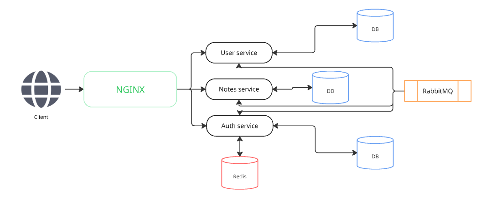

<p align="center">
    
</p>


# Awesome-notes

This is a API for writting notes in MarkDown format, it allows create users and notes, provides API Geteway authentification system

The general development purposes:
-  Learning FastAPI framework
-  Learning auth systems in microservices 
-  Learning CI/CD
-  Writting code in better architecture style as close as possible to real prodaction development 
-  Researching microservices architecture style and communications among micriservices
-  Improving testing style and quality

And it was just interesting as well)

## Tech stack  :wrench:
- languages and frameworks:

 [](https://fastapi.tiangolo.com/)  [](https://pypi.org/project/dependency-injector/)
- Data storages:

  
- infrastructure:

[](https://www.docker.com/)  
- Testing:

 [](https://testcontainers.com/)


## Project architecture :triangular_ruler:



Project is based on isolated microservices which have got their own database and communicate by message broker:
- **NGINX**: reverse proxy and API Gateway
- **User service**: service for users management
- **Notes service**: service for user`s notes management
- **Auth service**: service for authentication and also user`s and credentials creating
- **DBs**: each service have got their own database 
- **Redis**: using for refresh token store
- **RabbitMQ**: main communicatintg point among microservices


## Instalation :fire:

1. Copy this repo and cd to it

```bash
git copy <repo_url>
cd awesome-notes/
```

2. Next you need to create and fill config/development.env files, follow config/development.env.example which store in `/config`, or you can excecute following command to use test variables

```bash
cp config/development.env.example config/development.env
```

3. Finally execute following command to start project

```bash
docker compose -f docker-compose.dev.yml --env-file config/development.env up --build
```

4. Open your browser and follow one of these urls:
- `https://awesome-notes.com/auth/docs`: for auth service api docs
- `https://awesome-notes.com/user/docs`: for user service api docs
- `https://awesome-notes.com/notes/docs`: for notes service api docs

